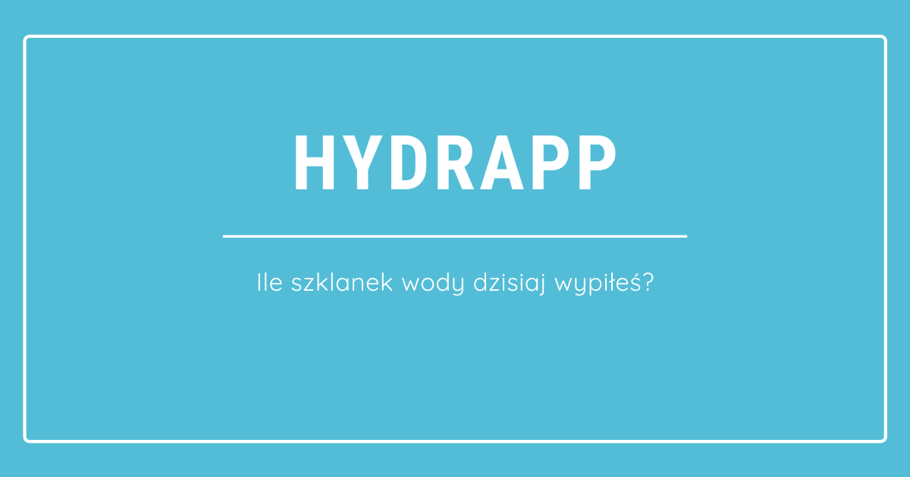

# HYDRAPP

Aplikacja, która mówi ile szklanek wody dzisiaj wypiłeś.

## Jak to odpalić?

Najpierw zrób `npm install`, a poźniej skorzystaj z następujących opcji:

`npm run start` - runs development mode

`npm run build` - runs build process for production

`npm run publish` - runs build process and publish the page using `gh-pages` branch

